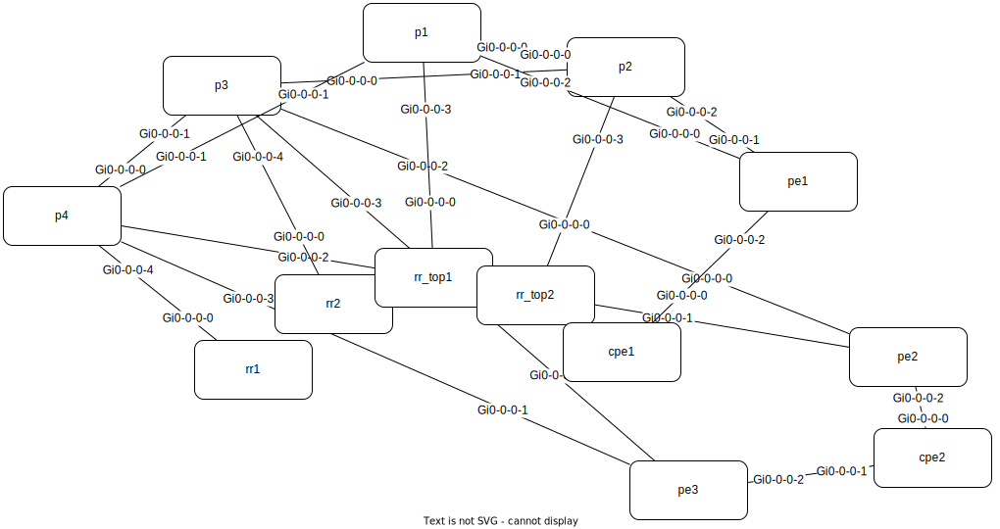
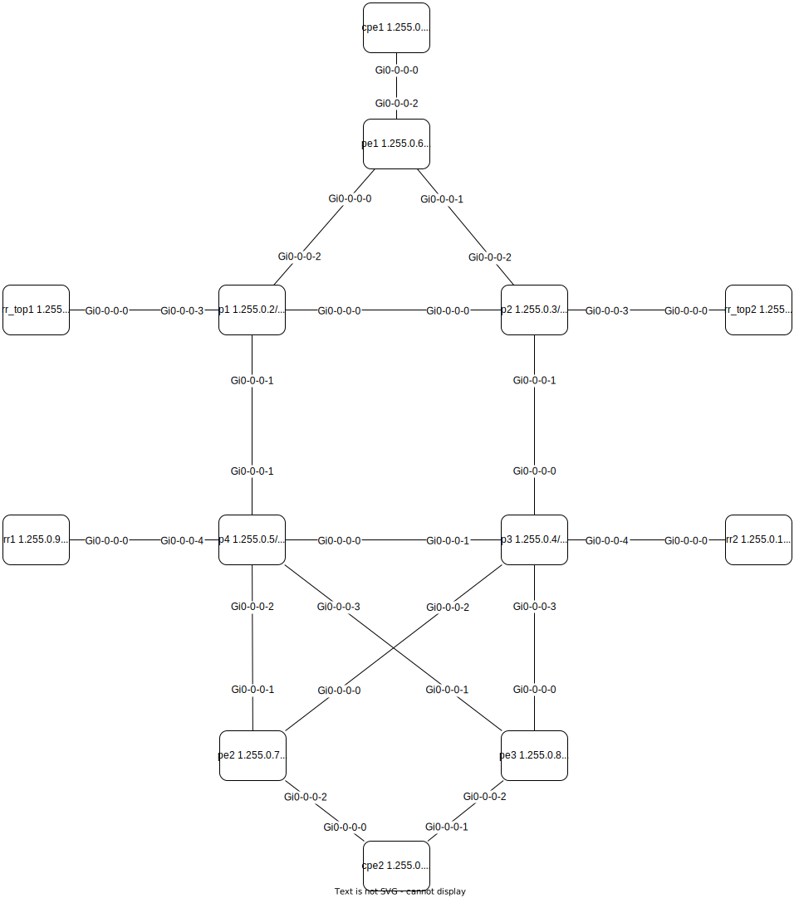

# Automated creation of virtual lab

https://github.com/vlisjak/lab-qd

## Overview

### Important functionality
- **Auto allocate router interface names** -> very simple topology definition: biggest time saver - no GUI clicking, no human errors!
- **Auto allocate IP addresses**: p2p, Loopback0, MgmtEth (2nd biggest time saver)
- **Multi-level inheritance** in YAML inventory (user-defined keywords) to avoid **inventory multiplication** 
- **Zero python coding** for additional network design concepts, such as multi-domain ISIS, two-level RRs, etc. (only tune YAML inventory and respective Jinja templates)
- **Dotted notation** allows more elegant consumption of nested YAML structures within Jinja2 templates
- Generate **drawio topology** (manual layout of nodes required only on first run - positions are then preserved)
- When appropriate, use of **python functions in Jinja** templates (native Jinja code can get really ugly compared to python, even for simple tasks)
- Provision **physical labs** by manually spcified interface names in YAML topology (IP addresses are still auto-allocated)

### System overview
- Yellow-shaded text: user-define content (YAML inventory and Jinja2 device templates)
- Blue-shaded text: lab operation steps
- Blue-color text: scripts execution


### Open source packages

**Containerlab** - lab orchestration  
https://containerlab.dev/quickstart/

**Nornir** - configuration framework + Napalm   
https://nornir.readthedocs.io/en/latest/tutorial/overview.html
- pythonic and faster than Ansible

**Jinja2** - templating  
https://jinja.palletsprojects.com/en/stable/

## Quick start

### Prerequisites

Few installation notes can found in [README-install-prerequisites.md](README-install-prerequisites.md); please check official manuals.

### Clone GIT repo
 
```bash
git clone https://github.com/vlisjak/lab-qd.git
```

### Install python libraries
```bash
cd lab-qd
pip install -r scripts/requirements.txt
pip install python-igraph
```

### Edit master.yaml

All lab parameters are defined in **master.yaml**. 

Two lab examples are provided:
- lab_mini folder: basic lab with minimal functionality to quickly spin up XRd lab, then auto-allocate interfaces and IPs
- lab_maxi folder: comprehensive example with link_groups, multi-instance IS-IS, hierarchical iBGP RRs, etc.

Sample master.yaml:
```yaml
clab_name: mini
drawio_diagram: topology.drawio

clab_startup:
  iosxr:
    image: ios-xr/xrd-control-plane:24.2.11
    kind: cisco_xrd
    startup-config: xrd_initial_cfg.j2
        
nornir_startup:
  iosxr:
    platform: iosxr
    group: iosxr
  inventory:
    plugin: SimpleInventory
    options:
      host_file: 'nornir/nornir_hosts.yaml'
      group_file: 'nornir/nornir_groups.yaml'
  runner:
    plugin: threaded
    options:
      num_workers: 10
  logging:
    log_file: nornir/nornir.log

device_groups:
  iosxr:
    username: clab
    password: clab@123
    clab:
      inherit_from: clab_startup.iosxr
    clab_intf_map: True
    nornir:
      inherit_from: nornir_startup.iosxr
    intf_naming:
      default:
        name: Gi0/0/0/
        first_id: 0
      core_bundle: 
        name: Bundle-Ether
        first_id: 1
      loopback0:
        name: Loopback
        first_id: 0

# Below is the actual lab inventory
# - "inherit_from" is used to avoid replication of same parameters across multiple elements (devices/links)
devices:
  p1:
    device_roles: [p]
    inherit_from: 
      - device_groups.iosxr
  p2:
    device_roles: [p]
    inherit_from: 
      - device_groups.iosxr
  p3:
    device_roles: [p]
    inherit_from: 
      - device_groups.iosxr

link_groups:
  core:
    link_group: core
    prefix: 1.0.0.0/16
    isis: 
      instance: CORE
  loopback0:
    link_group: loopback0
    prefix: 1.255.0.0/24
  mgmt:
    link_group: mgmt
    prefix: 10.255.0.0/24

# Topology definition
links:
  - link: p1---p2
    inherit_from: link_groups.core
  - link: p2---p3
    inherit_from: link_groups.core
  - link: p3---p1
    inherit_from: link_groups.core
```

### Generate lab startup files

```bash
# by default use master.yaml:
../scripts/lab_create.py

# but you can maintain different versions of same lab:
../scripts/lab_create.py -m master-MINI.yaml
```

The following inventories will be recreated by each run of lab_create.py:
```
.
├── clab_startup
│   └── clab_startup.yaml
├── master_complete.yaml       <<< final lab inventory (resolved inheritance, intf-names and ip addresses allocated)
└── nornir
    ├── nornir_config.yaml
    ├── nornir_groups.yaml
    └── nornir_hosts.yaml
```


Below is an excerpt from generated **master_complete.yaml**, which is then consumed by Jinja templates:
- inheritance resolved -> now Jinja templates has access to eg. link_group parameters directly under each distinct link
- interface names auto-allocated
- IP addresses auto-allocated from defined prefix
- LLDP-like records computed for each link -> this comes handy in Jinja templates
- device_roles are used by lab_configure.py to apply respective jinja templates

```yaml
devices:
  p1:
    clab:
      image: ios-xr/xrd-control-plane:24.2.11
      kind: cisco_xrd
      startup-config: xrd_initial_cfg.j2
    clab_intf_map: true
    device_roles:
    - p
    interfaces:
      Gi0/0/0/0:
        description: p1:Gi0/0/0/0 -> p2:Gi0/0/0/0
        ipv4_address: 1.0.0.1/30
        isis:
          instance: CORE
        link: p1---p2
        link_group: core
        lldp:
          neighbor: p2
          neighbor_intf: Gi0/0/0/0
          neighbor_ipv4: 1.0.0.2/30
        prefix: 1.0.0.0/16
      Gi0/0/0/1:
        description: p1:Gi0/0/0/1 -> p3:Gi0/0/0/1
        ipv4_address: 1.0.0.10/30
        isis:
          instance: CORE
        link: p3---p1
        link_group: core
        lldp:
          neighbor: p3
          neighbor_intf: Gi0/0/0/1
          neighbor_ipv4: 1.0.0.9/30
        prefix: 1.0.0.0/16
      Loopback0:
        description: p1 Loopback0
        ipv4_address: 1.255.0.2/32
      mgmt:
        ipv4_address: 10.255.0.2/24
    intf_naming:
      core_bundle:
        first_id: 1
        name: Bundle-Ether
      default:
        first_id: 0
        name: Gi0/0/0/
      loopback0:
        first_id: 0
        name: Loopback
    nornir:
      group: iosxr
      platform: iosxr
    password: clab@123
    username: clab
```

### Start/stop clab

Note: boot-up config with default username/pwd and mgmt IPv4 address can be found in `clab_startup/xrd_initial_cfg.j2`

Start the lab:
```bash
sudo containerlab -t clab_startup/clab_startup.yaml deploy
sudo containerlab -t clab_startup/clab_startup.yaml inspect
```

Stop:
> [!CAUTION] 
> Clab docker containers and device configs are completely removed!
```bash
sudo containerlab -t clab_startup/clab_startup.yaml destroy --cleanup
```


Additional frequently lab-operations commands can be found at [README-frequent-cmds.md](README-frequent-cmds.md)

### Connect to nodes
```bash
ssh cisco@clab-srte-p1
ssh cisco@clab-srte-p2
etc... 
```
Default clab credentials: `clab/clab@123`  
Additional user `cisco/cisco` is added by day0 boot-up config `startup-config: xrd_initial_cfg.j2`  

Get all ssh hostnames and mgmt IPs:
```bash
(myvenv310) vlisjak@vlisjak:~/containerlab/clab/lab_mini$ sudo containerlab -t clab_startup/clab_startup.yaml inspect
INFO[0000] Parsing & checking topology file: clab_startup.yaml 
+---+--------------+--------------+----------------------------------+-----------+---------+---------------+--------------+
| # |     Name     | Container ID |              Image               |   Kind    |  State  | IPv4 Address  | IPv6 Address |
+---+--------------+--------------+----------------------------------+-----------+---------+---------------+--------------+
| 1 | clab-mini-p1 | 61de6484e84a | ios-xr/xrd-control-plane:24.2.11 | cisco_xrd | running | 10.255.0.2/24 | N/A          |
| 2 | clab-mini-p2 | be6077cb3d09 | ios-xr/xrd-control-plane:24.2.11 | cisco_xrd | running | 10.255.0.3/24 | N/A          |
| 3 | clab-mini-p3 | a9f45aa5d7a3 | ios-xr/xrd-control-plane:24.2.11 | cisco_xrd | running | 10.255.0.4/24 | N/A          |
+---+--------------+--------------+----------------------------------+-----------+---------+---------------+--------------+
```


### Unshut interfaces and apply IP addresses (jinja: day0)

Naming of jinja templates: `templates/<section>/<section>_<device_role><device_group>.j2`  

Make sure that devices are reachable via ssh (manually ssh to devices), then deploy day0 configs:

> Notes: 
> - by default `--dry_run True`, so that nornir will display the diffs to current device configs, but not push the configs to devices.
> - Nornir config task will be skipped, if required jinja2 template does not exist

Sample output:
```bash
(myvenv310) vlisjak@vlisjak:~/containerlab/clab/lab_mini$ ../scripts/lab_configure.py network --sections day0
apply_config********************************************************************
* p1 ** changed : True *********************************************************
---- napalm_configure ** changed : True ---------------------------------------- INFO
--- 
+++ 
@@ -27,18 +27,25 @@
 line default
  transport input ssh
 !
+ipv4 netmask-format bit-count
 netconf-yang agent
  ssh
+!
+interface Loopback0
+ description p1 Loopback0
+ ipv4 address 1.255.0.2 255.255.255.255
 !
 interface MgmtEth0/RP0/CPU0/0
  vrf clab-mgmt
  ipv4 address 10.255.0.2 255.255.255.0
 !
 interface GigabitEthernet0/0/0/0
- shutdown
+ description p1:Gi0/0/0/0 -> p2:Gi0/0/0/0
+ ipv4 address 1.0.0.1 255.255.255.252
 !
 interface GigabitEthernet0/0/0/1
- shutdown
+ description p1:Gi0/0/0/1 -> p3:Gi0/0/0/1
+ ipv4 address 1.0.0.10 255.255.255.252
 !
 router static
  vrf clab-mgmt
^^^^ END apply_config ^^^^^^^^^^^^^^^^^^^^^^^^^^^^^^^^^^^^^^^^^^^^^^^^^^^^^^^^^^
```

After diffs are inspected, deploy the configs to devices `../scripts/lab_configure.py network --sections day0 --dry_run False`  

Further examples of `lab_configure.py`:
```bash
../scripts/lab_configure.py network --sections day0,isis,ibgp --dry_run=False
../scripts/lab_configure.py network --sections isis,day0 --dry_run=True --role pe
../scripts/lab_configure.py network --sections ibgp --node rr1
../scripts/lab_configure.py network --sections isis,srte --dry_run=True --node rr1 --role pce

../scripts/lab_configure.py service --kind l3vpn --instance vrf_1001 --endpoints cpe1
../scripts/lab_configure.py service --kind l3vpn --instance vrf_1001 --endpoints cpe2,cpe3
```

### Save device configs
Script will save the configs in `./device_configs` folder.

```bash
../scripts/lab_fetch_configs.py 
```

## Misc / HOW-TOs
> [!NOTE]  
> Under development ...

### Parameters in Jinja templates vs. YAML?
If your lab is static, and you don't plan to reuse the Jinja templates, then the most simple approach is to keep YAML inventory minimal, and encode variables directly in Jinja templates. This should work for "flat" designs, such as IS-IS single instance, full-mesh iBGP, all core links equally configured, etc.

> [!TIP]  
> Even if design is simple, but there's the chance that the parameter might change in the future, it is better to define this parameter in YAML inventory. Otherwise you will need to update potentially several Jinja templates each time some parameter is modified. 

However, when the design is more complicated, it is wise to encode the design parameters in YAML inventory.  

Example: multi-instance IS-IS design - assign links or link-groups to ISIS instances:
```yaml
link_groups:
  core:
    link_group: core
    prefix: 1.0.0.0/16
    isis: 
      instance: CORE
  rr:
    link_group: rr
    prefix: 1.0.0.0/16
    isis: 
      instance: RR
      metric: 99999
  links:
    - link: p1---p2
      inherit_from: link_groups.core
    - link: rr1:Gi0/0/0/9---p4
      inherit_from: link_groups.rr
```  
Example: multi-level iBGP RR hierarchy: YAML needs to define `PEs client-of -> mid-layer RRs -> client-of -> top-layer RRs`:
```yaml
device_roles:
  pe:
    device_roles: [pe]
    ibgp:
      asn: 100
      client_of: rr_mid
  rr_mid:
    device_roles: [rr_mid]
    ibgp:
      asn: 100
      client_of: rr_top
  rr_top:
    device_roles: [rr_top]
    ibgp:
      asn: 100
      # TBD: currently 'full_mesh' is not handled in iBGP .j2
      full_mesh: [rr_top]
```
### Topology definition
Most simple is to define the link (`---`) between the nodes, then `lab_create.py` will auto-allocate interface names:
```yaml
links:
  - link: p1---p2
    inherit_from: link_groups.core_bundle
```

Manually defining interface name on one or both endpoints allows to:
- fix interface names in clab (eg. always use 0/0/0/9 on RRs), or,
- create `master_complete.yaml` for physical lab, where interfaces are predefined by HW build
```yaml
  - link: p2---p3:Bundle-Ether32
    inherit_from: link_groups.core_bundle
  - link: rr1:Gi0/0/0/9---p4:Gi0/0/0/0
    inherit_from: link_groups.rr
```
Further notes: 
- when an interface ID is manually defined in `master.yaml`, that ID will be skipped by auto-allocation logic.
- parallel links are allowed between two nodes
- some links must not be inserted into clab startup file (eg. Bundles, interfaces of physical routers); this is controlled by `clab_exclude: True` parameter:
  ```
  link_groups:
    core_bundle:
      link_group: core_bundle
      clab_exclude: True
  ```
- device will be included in `clab_startup.yaml` only if it has a `clab` element (variable inherited from `clab_startup`)


### Clab interface naming and mapping
The following example shows the auto-allocation rules for XRd interfaces (similar needs to be defined for each OS kind):
- if interface belongs to link group core_bundle, the names start with: Bundle-Ether1, Bundle-Ether2, etc.
- otherwise (default): Gi0/0/0/0, Gi0/0/0/1, etc.
```yaml
device_groups:
  iosxr:
    clab_intf_map: True
    intf_naming:
      default:
        name: Gi0/0/0/
        first_id: 0
      core_bundle: 
        name: Bundle-Ether
        first_id: 1
```
Clab expects different interface naming in clab startup inventory for certain node kinds (eg. Gi0-0-0-x for XRd).

Device->Clab interface mapping logic is defined in `./scripts/utils.py -> clab_intf_map()`, such as:
```python
def clab_intf_map(clab_kind, device_if):
    if clab_kind == 'cisco_xrd':
        # https://containerlab.dev/manual/kinds/xrd/
        clab_if = re.sub('/', '-', device_if)
        return(clab_if)
    if clab_kind == 'cisco_c8000':
        # https://containerlab.dev/manual/kinds/c8000/
        clab_if = re.sub('/', '_', device_if)
        return(clab_if)
```

### IPv4 address auto-allocation

IPv4 addresses for p2p links are allocated sequentially from `prefix` defined under respective link group.

If prefix is not defined for a link group, IPv4 addressess will not be auto-allocated for respective links.

Examples:
```
link_groups:
  core:
    link_group: core
    prefix: 1.0.0.0/16
  core_bundle:
    link_group: core_bundle
    clab_exclude: True
    inherit_from: link_groups.core
    bundle:
      type: bundle
  core_bundle_member:
    link_group: core_bundle_member
    bundle:
      type: member
  rr:
    link_group: rr
    prefix: 1.0.0.0/16
  loopback0:
    link_group: loopback0
    prefix: 1.255.0.0/24
  mgmt:
    # If you're starting multiple clabs, you must use different mgmt prefix for each clab instance
    link_group: mgmt
    prefix: 10.255.1.0/24
  access_l3vpn:
    link_group: l3vpn
    prefix: 1.1.0.0/16
  access_l2vpn:
    link_group: l2vpn
  physical:
    # remember that intf. name is not auto-allocated for physical interfaces
    link_group: physical
    clab_exclude: True
```

### YAML inheritance - additional notes and examples
**Inherit nested YAML (sub)object**
`inherit_from` can point to a top-level YAML object, as well as nested "sub-objects" using dotted notation.
Example:
```yaml
parent:
  subA:
    key1: val1
  subB:
    key2: val2
    key3: val3
child:
  inherit_from: parent
  nested_once:
    inherit_from: parent.subB
  nested_twice:
    inherit_from: parent.subB.key2
```
Result:
```yaml
parent:
  subA:
    key1: val1
  subB:
    key2: val2
    key3: val3
child:
  subA:
    key1: val1
  subB:
    key2: val2
    key3: val3
  nested_once:
    key2: val2
    key3: val3
  nested_twice:
    key2: val2
```

**Multi-level inheritance** is allowed, such as:
```yaml
base:
  key1: val1
parent:
  key2: val2
  inherit_from: base
child:
  key3:
    inherit_from: parent
    key2: val3
```
Result:
> Note how key2 in child overrides the same inherited key from parent
```yaml
base:
  key1: val1
parent:
  key1: val1
  key2: val2
child:
  key3:
    key1: val1
    key2: val3
```

**Multiple `inherit_from` calls on same level**, should be defined as yaml list, such as:
```yaml
  p4:
    inherit_from: 
      - device_roles.p
      - device_groups.iosxr
```

### Zero-code to implement more complex lab designs

The inheritance concept of YAML inventory, bundled with flexibility of Jinja2 templates, allows for advanced network designs without additional python development. 

Having said that, it is recommended to account for all needs of final design already when defining master.yaml!
> **Basically the YAML file defines the design.** 

Otherwise, imagine you have developed many jinja2 templates based on master.yaml. And then you realize that some yaml object is not good (eg. need additional levels/nesting structure) -> that could imply changes to many existing jinja2 templates! -> So again, take the time to nail the master.yaml structure from day1.


### Jinja2 template inheritance
Similar to inheritance in YAML object, jinja2 `extends` allows to define a common template once and then reuse across multiple device types.
> Pay attendtion to `scoped` directive, if there's the need to access variables in child template.

day0_BASE_iosxr.j2:

```jinja

interface {{ intf }}
 {#- scoped allows to use variables in child template #}
  no shut
  
  description {{ intf_details.description }}
  


end
```

BASE template is then reused across multiple nodes, with minimal modifications.

day0_rr_iosxr.j2:
```jinja




  bandwidth 100

{{ super() }}

```

### Dotted notation for nested dicts in jinja2 templates

YAML content is normally consumed by jinja2 templates in the form of nested dict/list structures.

Example:

```django
router isis {{ master["link_groups"]["core"]["isis"] }}
  set-overload-bit on-startup 360 level 2
  is-type level-2-only
  net {{ intf_vars[node]["interfaces"]["Loopback0"]["ipv4_address"] | ipv4_to_isis_net }}
  nsf cisco
  log adjacency changes
```

Above does the job, but with complex inventory structures, jinja2 becomes quite "busy".

For this reason, I'm enhancing the YAML inventory (using python-box library), before it is passed to jinja2 for rendering.

Now we can make use of **dotted notation** -> much more elegant (at least to my eyes :))

```django
router isis {{ master.link_groups.core.isis }}
  set-overload-bit on-startup 360 level 2
  is-type level-2-only
  net {{ intf_vars[node].interfaces.Loopback0.ipv4_address | ipv4_to_isis_net }}
  nsf cisco
```
### Using python functions in jinja2 templates

Jinja2 code is also not so nice when extra functionality is required, such as: nested for/if/else/data transformation etc.

Instead of fighting with Jinja2 lingo, we can pass proper python functions to jinja rendering. 
Example below shows how to compute ISIS NET address from Loopback0 IP.

Function `ipv4_to_isis_net` is defined in `utils.py`:
```python
def ipv4_to_isis_net(ipv4_address, area_id="49.0001", nsel="00"):
    """
    Convert an IPv4 address to an IS-IS NET.
    Assumes the IPv4 address is the Loopback0 interface IP.
    """
    head, sep, tail = ipv4_address.partition("/")
    tmp = "{:0>3}{:0>3}{:0>3}{:0>3}".format(*head.split("."))
    return "49.0000.{}.{}.{}.00".format(tmp[0:4], tmp[4:8], tmp[8:12])
```

Then `lab_configure.py` is passing `ipv4_to_isis_net` to jinja2:
```python
if __name__ == "__main__":

    args = parseArgs()
    os.chdir(sys.path[0])

    jinja_env = Environment(trim_blocks=True, lstrip_blocks=True)
    jinja_env.filters["ipv4_to_isis_net"] = utils.ipv4_to_isis_net
```

And now users can profit from new filter in jinja2 templates:
```jinja
router isis {{ master.link_groups.core.isis }}
  set-overload-bit on-startup 360 level 2
  is-type level-2-only
  net {{ intf_vars[node].interfaces.Loopback0.ipv4_address | ipv4_to_isis_net }}
```

### Drawio topology

At each run of `lab_create.py` a Drawio topology is generated.
- filename is defined by `drawio_diagram` parameter in master.yaml (`drawio_diagram: topology.drawio`)

At first run, the N2G library attempts to layout the nodes, but usually the result is not particulary nice ..



Therefore, you need to manually arrange the nodes in `topology.drawio` - either using Drawio application, or directly in VScode (drawio extension).



From now on, whenever you run `lab_create.py`, the layout of existing nodes is extracted and preserved from existing `topology.drawio`.

Note: if you added new node(s) to `master.yaml` again open and manually adjust the new node in `topology.drawio`
- a bit cumbersome, though still easier than each time manually re-arranging the complete topology

## Network services

L3VPN definition example in `master.yaml`:

```yaml
services:
  l3vpn:
    vrf_1001:
      cust_id: 1001
      endpoints:
        cpe1:
          pe_routing: 
            protocol: static
        cpe2:
          pe_routing: 
            protocol: ebgp
        cpe3:
          uplinks:
            Gi0/0/0/0:
          pe_routing: 
            protocol: ebgp
            asn: 112233
```

Deploy service instance with:  
`../scripts/lab_configure.py service --kind l3vpn --instance vrf_1001 --dry_run False`

What happens in the background is explained below.

### "Transaction" scope

Nornir will by default try to deploy config to all nodes in the inventory -> this is no good with large networks.
We really want to target nornir only to those CPEs and PEs, that take part in this transaction.

Logic for L3VPN instances:
- if CPE has manually defined `uplinks`, we respect these (such as cpe3 above)  
    (`services[service][instance].endpoints[cpe].uplinks`)
- otherwise, we collect all PEs "seen" over CPE's `l3vpn` links  
    (`inv.devices[cpe].interfaces.link_group' == 'l3vpn'`)

Result - `trans_scope`:
```yaml
[Box({'cpe': 'cpe3', 'cpe_intf': 'Gi0/0/0/0', 'pe': 'pe2', 'pe_intf': 'Gi0/0/0/3'}),
 Box({'cpe': 'cpe2', 'cpe_intf': 'Gi0/0/0/0', 'pe': 'pe2', 'pe_intf': 'Gi0/0/0/2'}),
 Box({'cpe': 'cpe2', 'cpe_intf': 'Gi0/0/0/1', 'pe': 'pe3', 'pe_intf': 'Gi0/0/0/2'}),
 Box({'cpe': 'cpe1', 'cpe_intf': 'Gi0/0/0/0', 'pe': 'pe1', 'pe_intf': 'Gi0/0/0/2'})]
```

Note that other service types may require different structure for transaction scope -> hence per-service handling in `get_trans_scope()` function

### CPE-PE connectivity

There's no need to specify CPE-PE interfaces in `services/l3vpn`, because these already exist in `devices` section of `master_complete.yaml`. Same logic applies as in **Transaction scope** above.

Note that cpe2 in above example is dual-homed.
- The assumption in current YAML/Jinja implementation is that routing protocol on both links is the same
- Nothing prevents extending the YAML model and adjust Jinja2 templates, to allow primary/backup CPE scenario and backup link with static routing.

### Sample CPE Jinja2 template

```htmldjango


{# 
At this point I know that I'm one of the CPEs for specific service instance -> so we can surely configure the VRF
  - then we'll still need to figure out which are my PEs for this instance (because there could be PEs of other CPEs in trans_scope)
  - and whether each CPE is routed statically or ebgp #}

  
  {# check if this cpe is bgp-routed #}
  
    
route-policy PASS-ALL
  pass
end-policy
!
router bgp {{ my_asn }}
  address-family ipv4 unicast
   redistribute connected
  !
  neighbor {{ pe_ip }}
   remote-as {{ nodes[lldp.pe].ibgp.asn }}
   description {{ lldp.cpe_intf }} -> {{ lldp.pe }}:{{ lldp.pe_intf }}..{{ instance }}
   address-family ipv4 unicast
    route-policy PASS-ALL in
    route-policy PASS-ALL out
    as-override
   !
  !
 !
  {# otherwise, check if it is statically routed #}
  
!
router static
  address-family ipv4 unicast
    0.0.0.0/0 {{ pe_ip }} description {{ lldp.pe }}:{{ instance }}
  
!

end
```


